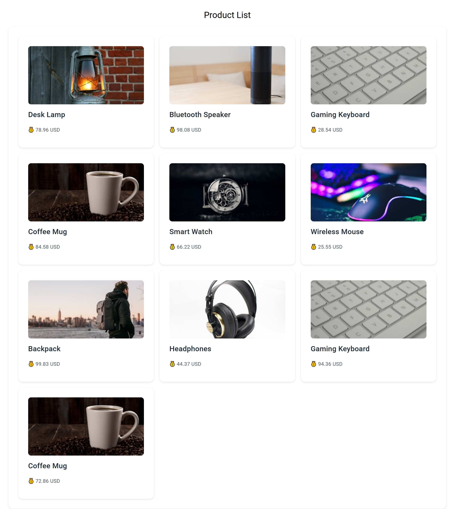

## 🛒 Product Listing App

A demo project built with Angular (Frontend) and Node.js + Express (Backend).  
This app displays a list of random products with name, price, and image.  

## Features
- Product list display
- Random price generation
- Product images (mocked)
- Angular + RxJS + HttpClient
- Node.js + Express API with CORS enabled

## 📂 Project Structure
e-commerce-app/

├── backend/ → Node.js + Express (API)

└── frontend/ → Angular project (UI)

## Clone the Repository
git clone https://github.com/afzal20071991/e-commerce-app.git

cd e-commerce-app

## Backend Setup (API)
cd backend

npm install

node server.js

API will run at: http://localhost:3000/products

## Frontend Setup (Angular)

cd frontend

npm install

ng serve

Angular app will run at: http://localhost:4200/

## 📸 Screenshots
## Frontend (Angular UI)

### Backend (API Response)

